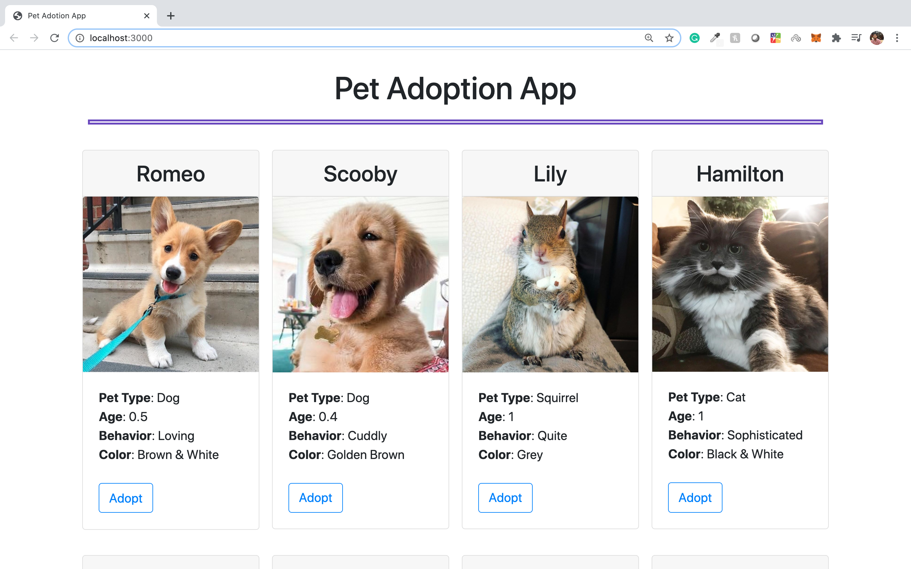

# Pet Adoption App Blockchain

---

#### Steps for executing the application:

1. Download/clone the project.
2. Execute <b>npm intstall</b> CLI command (make sure node is installed and working). It will install all the required node modules
3. Execute <b>truffle migrate</b> CLI command. It will deploy the contract.
4. Finally the run the project by running CLI command <b>npm run dev</b>.

##### Or you can see the youtube demo of how to execute the project:

___

## References:

* https://www.trufflesuite.com/tutorials/pet-shop
* https://www.youtube.com/watch?v=coQ5dg8wM2o
* https://github.com/Alexintosh/Adopt-a-Pet-dapp
* corgi image: https://favim.com/image/7073677/
* retriver image: https://hypeauditor.com/preview/tuckerbudzyn/ 
* rest of the animals’ photo was taken from: https://www.goodhousekeeping.com/life/pets/advice/g1236/animal-instagrams/?slide=19

