# Pet Adoption App Blockchain

---

#### Steps for executing the application:

1. Download/clone the project from the GitHub repository: https://github.com/Bhagydeep24/PetAdoptionAppBlockchain
Note: For TA this README will be in the code submission so downloading code from repository won’t be required.

2. Once project is downloaded Execute <b>npm intstall</b> CLI command (make sure node is installed and working) in the terminal making sure current directory is the project downloaded. This step will install all the required node modules.

3. Download [Ganache]: https://www.trufflesuite.com/ganache and make the application running.

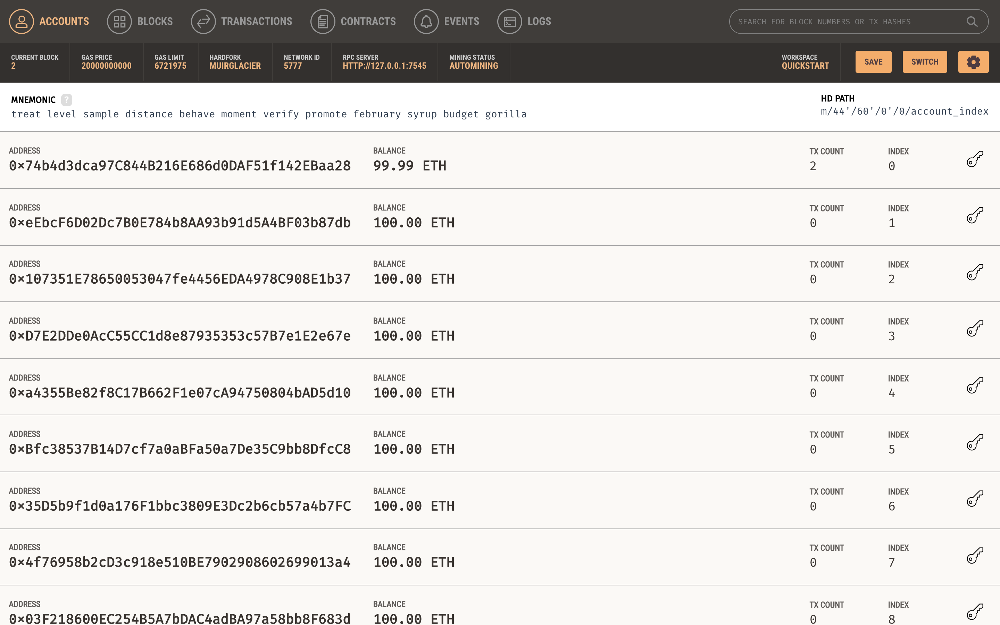

4. Next step we need to check if the Ganache connection details with the project is set properly. For that we have <b>truffle-config.js</b> file in the project and we just need to confirm. And those host and port is available Ganache application on top. Both code and details in Ganache would look something like below:

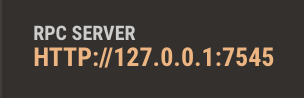

5. Once connection is confirmed then we will execute 2 CLI commands <b>truffle compile</b> and then <b>truffle migrate</b>. (if there is no truffle installed you can install by CLI command <b>npm install -g truffle@5.0.2</b>)

6. Once both the commands are executed without any error we will run the project using CLI command <b>npm run dev</b> which open our project in browser and it will look something like below

7.  Next we will need Metamask extension install on our browser for the transaction. And after we are logged in our Metamask account we need to set up private network. So click on network dropdown button on top right and select <b>custom RPC</b>. This whole process will look like below figure on browser extension.

8. Once we click on custom RPC we will need to fill in details. Below 2 figures are before filling details and after filling those details.

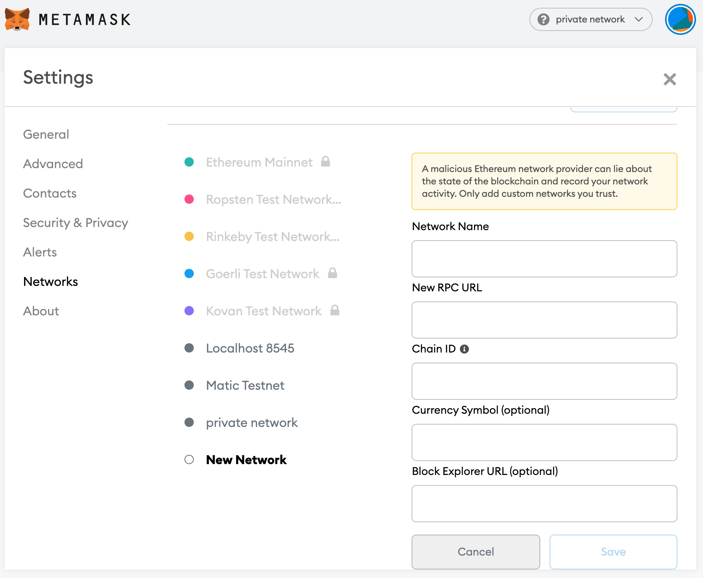

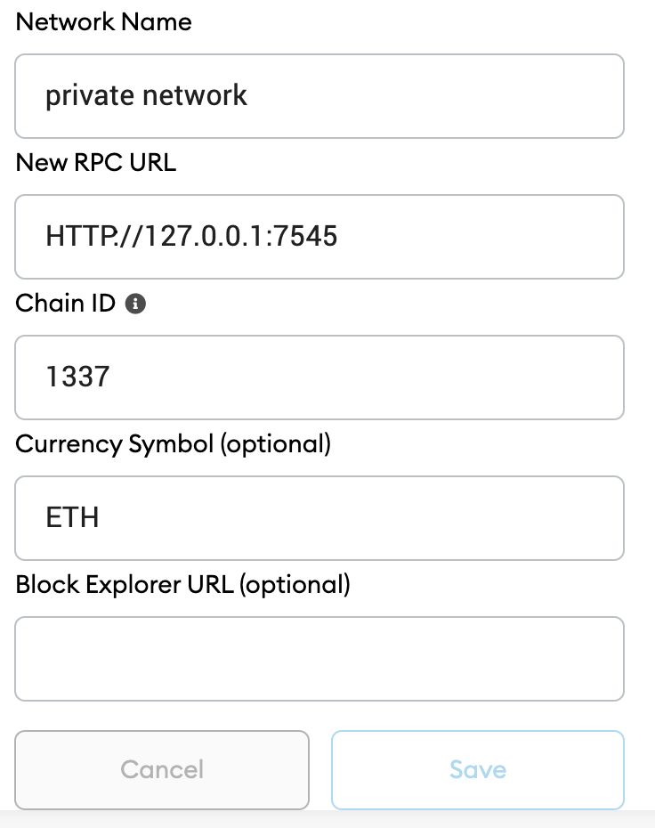

9. Now our private network is set. And it will look something like figure below when we click on Metamask extension icon. Make sure private network is selected.

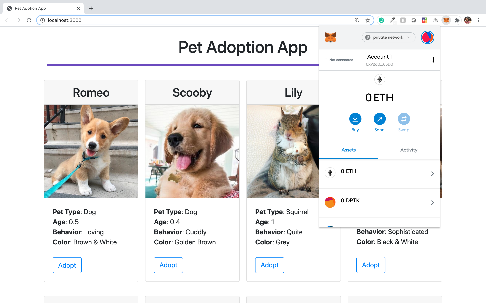

10. Next step, we need to import address from running Ganache application to this private network. For that click on circle icon next to private network written drop down on right top. Which will look like below figure.

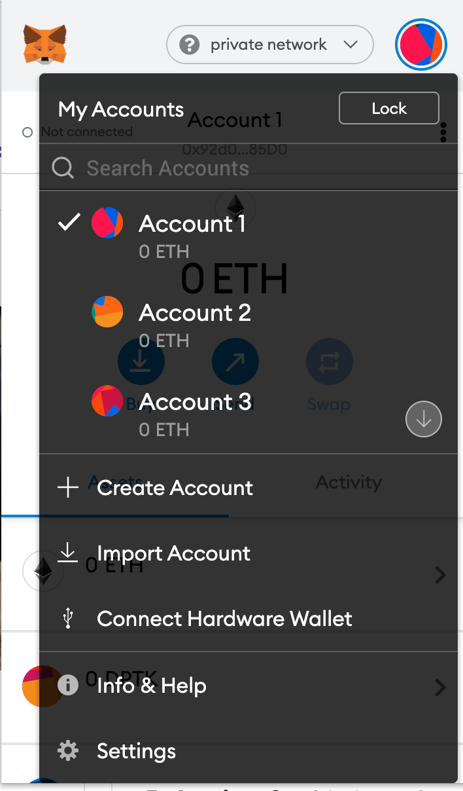

11. Next we will select import account which will open below figure dialog. And here we need to paste the private key of the address we want to connect to the private network.

12. We can get that private key from Ganache application. Open the running Ganache window and select the key icon on the right and we can pick any address we want. Here we are going to select key icon for top most address (0x74b4…).

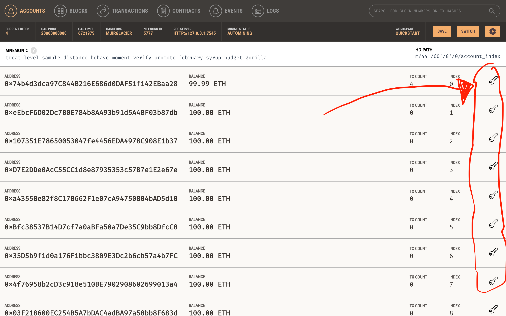

13. Once we click on key icon it will open dialog box given in below figure just copy that private key. (Here to avoid any misuse I have hidden the private key).

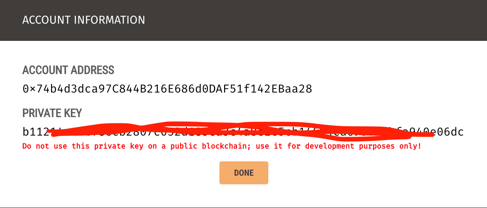

14. Once we copy the key, paste that in dialog box opened in step 11. And click import. We can see in below figure after successful import our Ganache address(0x74b4..) is now available here.

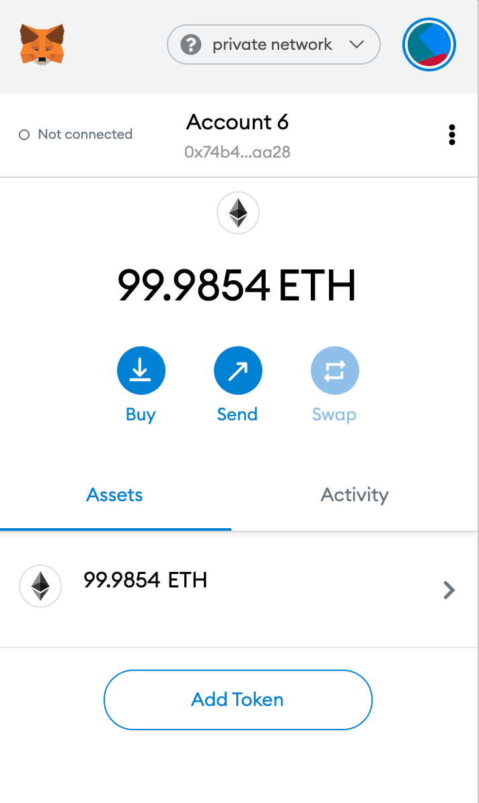

15.  We can see that not connected text on top left corner it means our running localhost website is not connected with this account. For that click on three dot icon next to Account 6 and select Connected sites which will ask to Manually connect to current site. 

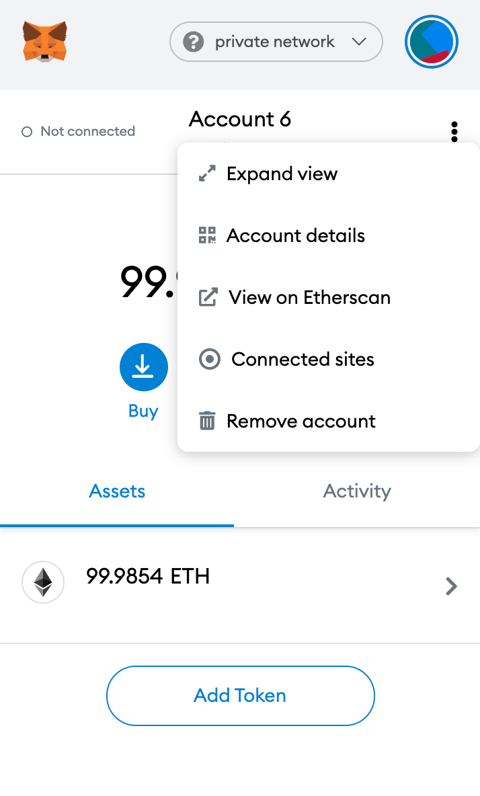

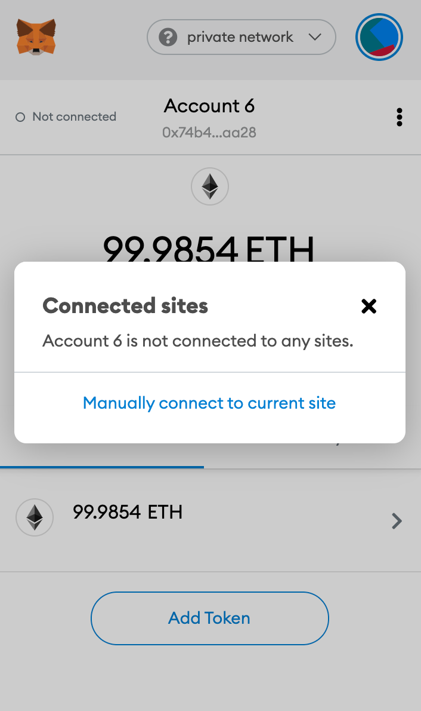

16. Then it will ask to select manually which account to connect make sure account we imported is selected. Then press next and finally click confirm.

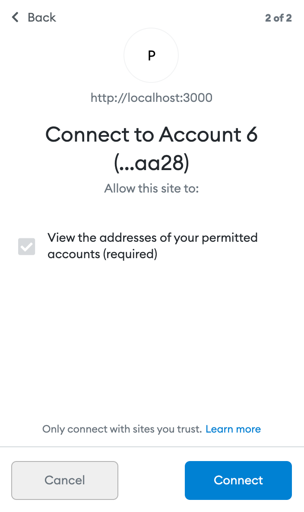

17. Next we can see now it shows Connected.

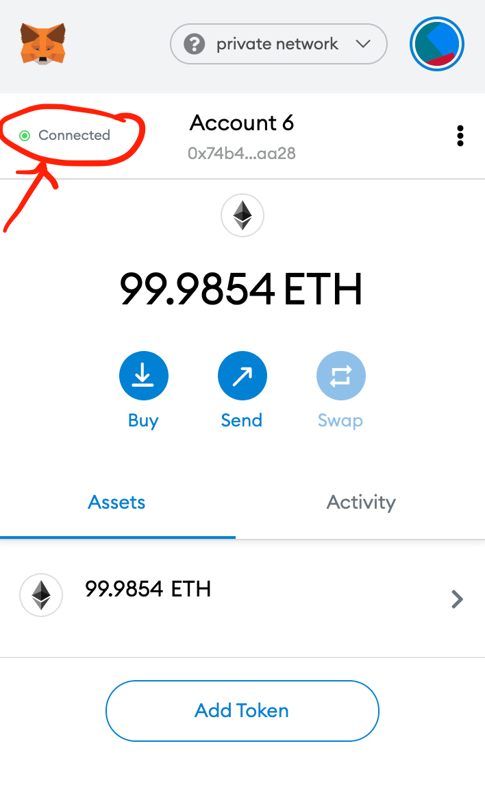

18. Now all setup is completed finally and we can test our application. Now make sure you see figure similar to one in step 6. Here click on adopt button on any pet you want to adopt. And once we click on that it will open a popup asking for the transaction confirmation just like below figure.

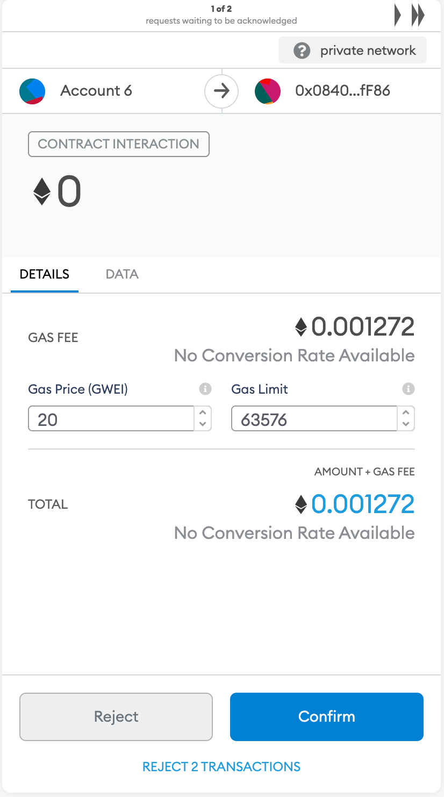

19. And once we confirm the transaction that pet you clicked is adopted by you and the adopt button is no longer available for that pet and it is replaced by success button.

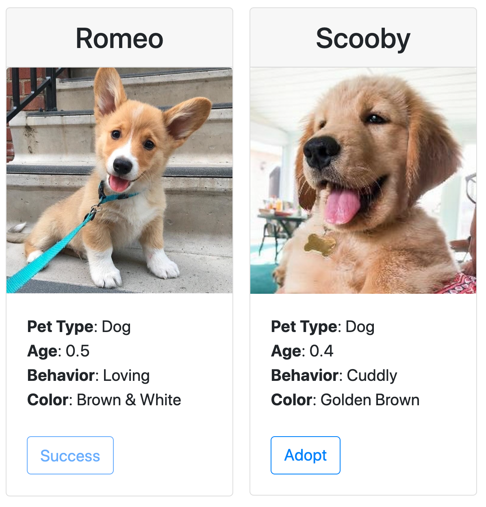

##### Or you can see the youtube demo of how to execute the project:

___

## References:

* https://www.trufflesuite.com/tutorials/pet-shop
* https://www.youtube.com/watch?v=coQ5dg8wM2o
* https://github.com/Alexintosh/Adopt-a-Pet-dapp
* corgi image: https://favim.com/image/7073677/
* retriver image: https://hypeauditor.com/preview/tuckerbudzyn/ 
* rest of the animals’ photo was taken from: https://www.goodhousekeeping.com/life/pets/advice/g1236/animal-instagrams/?slide=19

